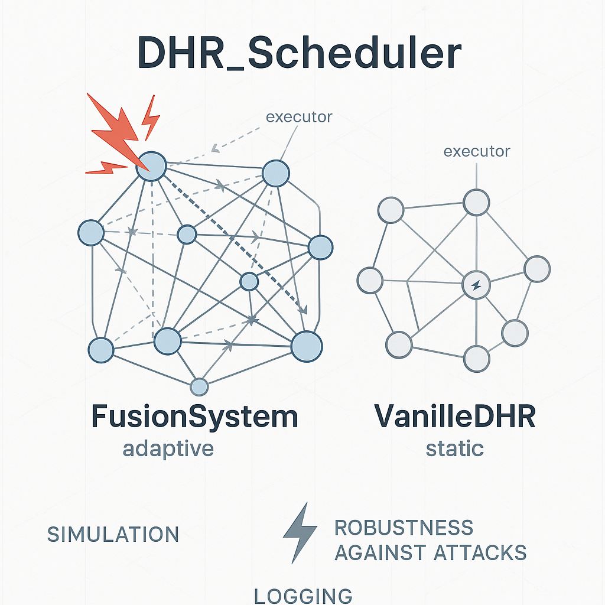

# DHR_Scheduler Simulation Platform

<p align="center">
   
</p>

## Project Overview
DHR_Scheduler is a simulation platform for evaluating the robustness of Distributed Heterogeneous Redundancy (DHR) systems under attack scenarios. It supports two typical architectures: Adaptive Fusion System (FusionSystem) and Static Redundancy System (VanilleDHR).

## Features
- Simulate attacks and fusion decisions across multiple execution units
- Support adaptive weight adjustment, soft-offline, and full replacement mechanisms
- Configurable parameters: multi-round attacks, attack probability, recovery mechanism, etc.
- Automatic statistics for output accuracy, scheduling counts, and other performance metrics
- Detailed logging of each simulation round

## Directory Structure
```
├── main.py                # Main simulation entry point, experiment loop
├── FusionSystem.py        # Adaptive fusion system implementation
├── VanilleDHR.py          # Static redundancy system implementation
├── logger_config.py       # Logging configuration
├── logs/                  # Simulation log output directory
├── assets/                # Project assets (e.g., logo)
├── README.md              # Project documentation
```

## Quick Start
1. Install dependencies:
   ```bash
   pip install scipy
   ```
2. Run the main simulation:
   ```bash
   python main.py
   ```
3. Check the log outputs and statistical results in the logs/ directory.

## Main Parameters
- `NUM_UNITS`: Number of execution units
- `NUM_ROUNDS`: Number of simulation rounds
- `ATTACK_PROB`: Attack probability per round
- `recoverTime`: Recovery wait time after scheduling

## Output Metrics
- Output counts and accuracy for each system (A/B)
- Scheduling (full replacement) counts for each system
- Weight changes for each execution unit
- Detailed logs for each round's output and status

## Typical Usage
- Compare the robustness of FusionSystem and VanilleDHR under different attack probabilities and recovery times
- Analyze the performance improvement brought by adaptive mechanisms

## Contact
For questions or suggestions, please contact the project maintainer.
